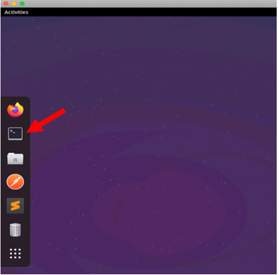
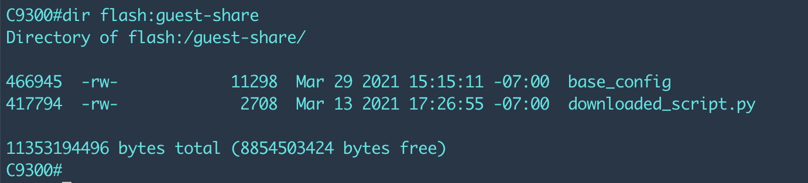

# Module 1: Guestshell and Guest-share


## Topics Covered:

[Guestshell](#guestshell-with-guest-share)

[Enable Guestshell](#enable-guestshell)

[On-Box Interactive Python](#On-Box-Interactive-Python)

[EEM Integration](#EEM-Integration)

[Conclusion](#conclusion)


## Guestshell with Guest-share

In this section we will look at IOS XE's on-box Linux container and its capabilities. We will see how to enable it, how to use it to run Python scripts, and how to integrate it with EEM.


## Enable Guestshell

Guestshell Python runs in an LXC container. This container is managed by IOX, which is a container manager specifically for IOS XE which is similar in function to Docker. Before using the guestshell, we must enable IOX and then enable guestshell.

 Step 1.     Login to the RDP **(username/password: auto/programmability@LAB)** from the POD access details provided by the proctor and connect to the C9300 switch using terminal



```
auto@programmability:~$ ssh admin@10.1.1.5
Password: Cisco123
C9300# 
```

```
C9300#conf t
Enter configuration commands, one per line. End with CNTL/Z.
C9300(config)# no iox

C9300(config)# iox
```

Enter the following command to check IOX services are enabled and running.


Additionally the **show app-hosting list** CLI can be used to show the state of the guestshell container:


 Step 2.     Configure and enable guestshell with the following commands:

```
conf t
iox
ip nat inside source list NAT_ACL interface vlan 1 overload
ip access-list standard NAT_ACL
permit 192.168.0.0 0.0.255.255
exit
vlan 4094
exit
int vlan 4094
ip address 192.168.2.1 255.255.255.0
ip nat inside
ip routing
ip route 0.0.0.0 0.0.0.0 10.1.1.3

app-hosting appid guestshell
 app-vnic AppGigabitEthernet trunk
  vlan 4094 guest-interface 0
   guest-ipaddress 192.168.2.2 netmask 255.255.255.0
   exit
  exit
 app-default-gateway 192.168.2.1 guest-interface 0
 name-server0 128.107.212.175
 name-server1 64.102.6.247
 exit
interface AppGigabitEthernet1/0/1
 switchport mode trunk
end
```

**NOTE** If you see errors with **ip nat** commands then check the license level as DNA Advantage is required. Your switch has already been configured with the DNA Advantage license.


 Step 3.     Start the Guest Shell container to enter into the Bash shell by sending the **guestshell enable** followed by the **guestshell** CLI - Note that it may take up to 1 minute to enable and enter the container.

```
C9300#guestshell enable

<< wait about 30 seconds >>

Interface will be selected if configured in app-hosting
Please wait for completion
guestshell installed successfully
Current state is: DEPLOYED
guestshell activated successfully
Current state is: ACTIVATED
guestshell started successfully
Current state is: RUNNING
Guestshell enabled successfully


C9300#guestshell

<< wait about 1 minute >>

[guestshell@guestshell ~]$
```


**Note** if you get any "iox feature is not enabled" error like below then do "no iox" and "iox" in the configuration mode.

```
C9300#guestshell enable 
 iox feature is not enabled
C9300# 
C9300#conf t
Enter configuration commands, one per line.  End with CNTL/Z.
C9300(config)#no iox
C9300(config)#iox
C9300(config)#end
```


Step 4. Enter the guestshell CLI. This guestshell container can access the device bootflash **guest-share** directory only.

```
c9300# guestshell
[guestshell@guestshell ~]$ df
Filesystem     1K-blocks    Used Available Use% Mounted on
/dev/loop11       991020  265963    675057  29% /
tmpfs            3875564    9956   3865608   1% /cisco/cisco_cli
tmpfs            3875564  138600   3736964   4% /cisco/.iosp_socket
/dev/sdb3       11087104 4638656   5885248  45% /bootflash/guest-share
tmpfs                 64       0        64   0% /sys/fs/cgroup
devfs                 64       0        64   0% /dev
/dev/loop10         1050      21       955   3% /data
rootfs           3852604  115392   3737212   3% /local/local1/core_dir
tmpfs            3875564       0   3875564   0% /dev/shm
tmpfs            3875564    4144   3871420   1% /run
none             3875564       8   3875556   1% /var/volatile
[guestshell@guestshell ~]$
[guestshell@guestshell ~]$
[guestshell@guestshell ~]$ cd /bootflash/
[guestshell@guestshell bootflash]$ ls
guest-share
[guestshell@guestshell bootflash]$ cd guest-share
guest-share
[guestshell@guestshell guest-share]$ ls
20210319-230210_shrun  base_config  cfg.py  current_config_name  diff  downloaded_script.py
```

**NOTE**: If you don't see all those files in guest share directory. Don't worry about that those files are from previous lab which we will delete now and create new files.


Delete all the files as follow. All the files will get deleted except ‘downloaded_script.py' because its write protected. 

```
[guestshell@guestshell guest-share]$ rm *
rm: remove write-protected regular file 'downloaded_script.py'?
[guestshell@guestshell guest-share]$ ls
downloaded_script.py
[guestshell@guestshell guest-share]$
```

Verify python version by executing the following command.

```
[guestshell@guestshell ~]$ python3 --version
Python 3.6.8
[guestshell@guestshell ~]$
```


 Step 5.     Exit the guestshell by sending exit command and returning to the IOS XE CLI

```
[guestshell@guestshell ~]$ exit
```

The guestshell environment is a typical Linux virtual machine -- it has all of the tools available, including Python, Bash, yum, vi, etc. There are many possibilities having this capabilities within the IOS XE networking device.

## On-Box Interactive Python

Just as we can on Ubuntu or Windows, we can run the interactive python shell on IOS XE. We can also make CLI calls from here.

```
C9300#guestshell run python3
Python 3.6.8 (default, Aug 24 2020, 17:57:11)
[GCC 8.3.1 20191121 (Red Hat 8.3.1-5)] on linux
Type "help", "copyright", "credits" or "license" for more information.
>>>
>>> print ("hello")
hello
>>>
```

 Step 1.     Now we will import the **cli** module and test sending CLI to the device.

```
>>> import cli
>>> cli.cli('show version')
'Cisco IOS XE Software, Version 17.04.01\nCisco IOS Software [Bengaluru], Catalyst L3 Switch Software (CAT9K_IOSXE), Version 17.4.1, RELEASE SOFTWARE (fc5)\nTechnical Support: http://www.cisco.com/techsupport\nCopyright (c) 1986-2020 by Cisco Systems, Inc.\nCompiled Thu 26-Nov-20 23:35 by mcpre\nCisco IOS-XE software, Copyright (c) 2005-2020 by cisco Systems, Inc.\nAll rights reserved.  Certain components of Cisco IOS-XE software . . .
```

 Step 2.     Now we will import the **clip** function from CLI module and test sending CLI to the device. It will print in a stdout rather than returning it. **Stdout**, also known as "standard output", is the file where a program writes its output data.

```
>>> from cli import clip
>>> cli.clip('show version')
Cisco IOS XE Software, Version 17.04.01
Cisco IOS Software [Bengaluru], Catalyst L3 Switch Software (CAT9K_IOSXE), Version 17.4.1, RELEASE SOFTWARE (fc5)
Technical Support: http://www.cisco.com/techsupport
Copyright (c) 1986-2020 by Cisco Systems, Inc.
Compiled Thu 26-Nov-20 23:35 by mcpre
Cisco IOS-XE software, Copyright (c) 2005-2020 by cisco Systems, Inc.
```

Notice that the output of the **clip** function is much easier to read than before.

 Step 3.     **configure** is another function available in the **cli** module to provision the device. Create loopback 99 with ip address 99.99.99.99 using the **configure** function as follows.

```
>>> cli.configure(["interface loopback 99", "ip address 99.99.99.99 255.255.255.255", "end"])
```

 Step 4.     Verify the interface **loopback 99** has been created by using the **clip** function.

```
>>> cli.clip('sh ip int br')
```

 Step 5.     Exit the interactive shell by executing **quit()**

## EEM Integration

Embedded Event Manager (EEM) is a distributed and customized approach to event detection and recovery. EEM offers the ability to monitor an event and take a desired action when that event occurs. In this section, we will create a script that runs a diff between the current running config and the base configuration we use for our switches. 

Before starting the next tasks we must first save the “base config” to the bootflash:

```
c9300# copy running-config flash:guest-share/base_config
```


Verify the file in guest-share directory

```
C9300#   dir flash:guest-share
```





 Step 1.     Go to guestshell and use **vi** to edit a new file called **cfg.py**.

```
c9300#guestshell

[guestshell@guestshell ~]$ vi /bootflash/guest-share/cfg.py
```

 Step 2.     Hit "i" to insert text, and then paste the following script into vi:

```
import os
from cli import cli
import time
import difflib

def save_config():
  output = cli('show run')
  timestr = time.strftime("%Y%m%d-%H%M%S")
  filename = "/bootflash/guest-share/" + timestr + "_shrun"

  f = open(filename,"w")
  f.write(output)
  f.close

  f = open('/bootflash/guest-share/current_config_name','w')
  f.write(filename)
  f.close

  return filename

def compare_configs(cfg1,cfg2):

  d = difflib.unified_diff(cfg1, cfg2)

  diffstr = ""

  for line in d:
    if line.find('Current configuration') == -1:
      if line.find('Last configuration change') == -1:
        if (line.find("+++")==-1) and (line.find("---")==-1):
          if (line.find("-!")==-1) and (line.find('+!')==-1):
            if line.startswith('+'):
              diffstr = diffstr + "\n" + line
            elif line.startswith('-'):
              diffstr = diffstr + "\n" + line
  return diffstr

if __name__ == '__main__':

  old_cfg_fn = "/bootflash/guest-share/base_config"
  new_cfg_fn = save_config()

  f = open(old_cfg_fn)
  old_cfg = f.readlines()
  f.close

  f = open(new_cfg_fn)
  new_cfg = f.readlines()
  f.close

  diff =  compare_configs(old_cfg,new_cfg)
  f = open("/bootflash/guest-share/diff","w")
  f.write(diff)
  f.close
```


  Hit **ESC** to exit edit mode, and then type **":wq"** to save and quit.


 Step 1.     The current script will run a diff between the current config and the running config, but we don't want to just run it. We want it to be triggered every time there is a config change. We will use EEM to accomplish this. Leave guestshell with exit.

```
[guestshell@guestshell ~]$ exit
```


 Step 3.     Add the following config to your switch.


```
conf t
event manager applet config_change
 event syslog pattern "SYS-5-CONFIG_I"
 action 0 cli command "enable"
 action 1 cli command "guestshell run python3 /bootflash/guest-share/cfg.py"
end
```


 Step 4.     Exit and save your config. The act of exiting configuration mode will immediately fire off the on-box script. Check the guest-share and you will see the file. You can examine it with **more**.

```
C9300#  dir flash:guest-share
C9300# more flash:guest-share/diff
```


## Conclusion

In this module the Guestshell was configured,  guest-shared folder was explored,  on-box python API has tested and EEM has integrated.
